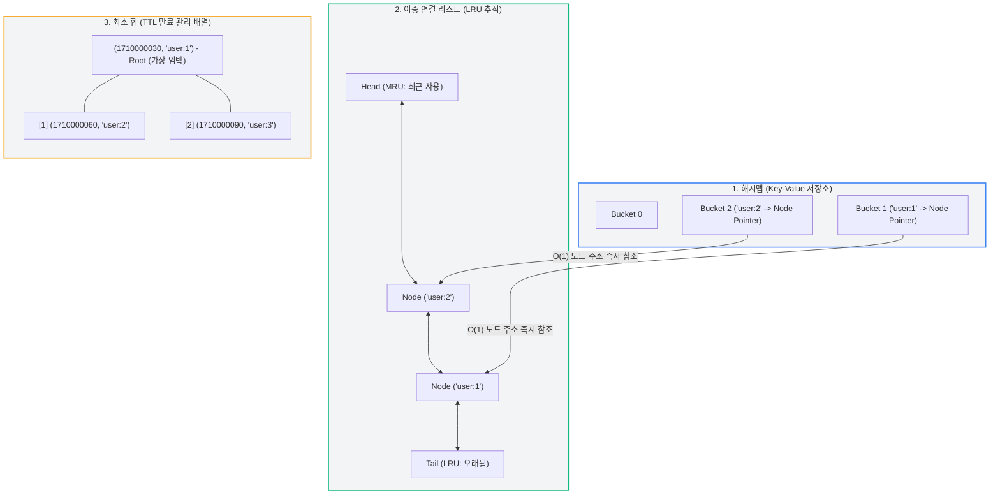

# 정보를 엄청 빠르게 찾아주는 작은 저장소 만들기

<br>

## 과제 개요
이 과제는 `Redis` 를 이용해 정보를 빠르게 찾아주는 작은 저장소를 만드는 미션이다.

평소 레디스가 빠르다는건 알고있지만, 그 속에 있는 `HashMap`(빠른 Key-value 저장), `연결리스트` (LRU), `Heap`(TTL) 을 직접 만들어보면서 왜 빠른지 체감할 수 있는 미션이다.

### Redis란?
`Remote Dictionary Server`로, 데이터를 DISK가 아니라 `MEMORY`(RAM)에 저장하는 저장소 이다.

캐시(자주 조회하는 데이터를 잠깐 저장해서 DB 부담 줄이기), 세션 저장, 실시간 랭킹 등에 사용된다.

- 일반 DB와 Redis 의 비교

    | 구분 | 저장 위치 | 설명
    | -- | -- | -- | 
    | 일반 DB | 디스크 | 안정적이지만 느림 |
    | Redis (In-Memory DB) | 메모리 | 전원 꺼지면 휘발되지만 대신 훨씬 빠름 |


<br>

## 자료구조
Redis 가 빠른 이유는 각 문제(조회, 제거 우선순위, 만료 우선순위)에 딱 맞는 자료구조를 골라 조합했기 때문이다.
이번 미션은 그 조합을 dict 나 set 같은 내장도구 없이 직접 짜보면서, 왜 O(1) 이 되는지 체감할 수 있다.

|  자료구조 | 정의 |  상황	| 필요한 연산 | 
| -- | -- | -- | -- |
| HashMap | Key를 숫자로 변환(Hash)해서 배열 칸에 저장하는 구조 | 값을 저장/조회	| key로 `O(1)` 접근	| 해시맵 |
| 이중 연결 리스트 | 노드들이 `Prev`(이전 노드 주소), `Next`(다음 노드 주소)를 서로 들고 있는 구조 | 메모리 초과 시 뭘 지울지 | "가장 오래 안 쓴 것" `O(1)` 파악 | 	
| 최소 힙 | `부모가` 항상 자식보다 `작은 값을 가지는` 배열 기반 트리 | TTL 만료 시 뭘 지울지 | "가장 빨리 만료될 것" `O(log n)` 파악 |


<br>

## 프로젝트 구조
```
main.py                              # 실행 진입점 (python main.py)
mini_redis/
├── data_structures/
│   ├── doubly_linked_list.py        # 이중 연결 리스트 (Node, DoublyLinkedList)
│   ├── hash_map.py                  # 체이닝 방식 해시맵 (직접 설계한 해시 함수)
│   └── min_heap.py                  # 최소 힙 (TTL 관리)
├── store.py                         # 핵심 엔진: SET/GET/DEL + LRU + TTL + 메모리 관리
├── commands.py                      # 명령어 파싱/디스패치 + Redis 스타일 출력 포맷
└── cli.py                           # REPL 루프
tests/                                # 자료구조 및 명령어 단위 테스트
```

## 실행 방법
```bash
python3 main.py
```

## 테스트 실행
```bash
python3 -m unittest discover -s tests
```

## 지원 명령어
- String: `SET`, `GET`, `DEL`, `EXISTS`, `DBSIZE`, `KEYS`
- 메모리 관리: `CONFIG SET maxmemory <bytes>`, `INFO memory`
- TTL: `EXPIRE <key> <seconds>`, `TTL <key>`
- 종료: `exit` / `quit`

## 동작 규칙
- `CONFIG SET maxmemory 0` : 0은 "무제한"을 의미하며, 이 경우 LRU 자동 제거가 동작하지 않는다.
- `EXPIRE key seconds` : seconds가 0 이하이면 "즉시 만료"로 처리되어 해당 key가 즉시 삭제된다.

### 실행 예시
```python
mini-redis> CONFIG SET maxmemory 30
# maxmemory = key 값 + value 값 (UTF-8의 바이트 길이를 계산한다.)
OK

mini-redis> SET user:1 "Alice"  # key 6개 + value 5개 = 11개
OK

mini-redis> SET user:2 "Bob"  # key 6개 + value 3개 = 9개
OK

mini-redis> SET user:3 "Charlie"  # key 6개 + value 7개 = 13개
OK

mini-redis> GET user:1
(nil)                          # maxmemory 초과로 LRU였던 user:1이 자동 제거됨
mini-redis> INFO memory
used_memory:22
maxmemory:30
evicted_keys:1
```
## 제약 사항 준수
- `dict`, `set`, `collections` 미사용 (해시맵/캐시/명령어 디스패치 테이블 모두 직접 구현한 자료구조 또는 list 기반으로 처리)
- 네트워크 통신, 파일 영속성, List/Set/Sorted Set, 멀티스레딩은 구현하지 않음 (요구사항 범위 외)

깃허브(GitHub) README나 TIL(Today I Learned) 레포지토리에 깔끔하게 정리하여 올릴 수 있도록 작성한 **Markdown(`.md`) 문서**입니다. 그대로 복사해서 사용하실 수 있습니다!

---

# Study  
내장 컬렉션(`dict` 등)을 사용하지 않고 해시맵, 이중 연결 리스트, 힙을 밑바닥부터 구현하면서 학습한 내용을 바탕으로 작성되었습니다.

---

## 1. 자료형 vs 자료구조 vs 알고리즘

| 구분 | 정의 | 대표 예시 |
| :--- | :--- | :--- |
| **자료형 (Data Type)** | 프로그래밍 언어나 시스템에서 기본적으로 제공하는 데이터의 형태 및 내장 타입 | `int`, `string`, `float`, `boolean` 등 |
| **자료구조 (Data Structure)** | 데이터를 효율적으로 저장, 관리, 조회하기 위해 메모리상에 구축한 저장 방식과 구조 | `Array`, `Hash Map`, `Doubly Linked List`, `Min Heap` 등 |
| **알고리즘 (Algorithm)** | 저장된 데이터를 조작하거나 특정 문제를 해결하기 위한 명확한 절차와 로직 | LRU 자동 제거 정책, `heapify_up`/`down`, 체이닝 충돌 해결 등 |

---

## 2. 주요 자료구조의 정의, 역할 및 메모리 할당 방식

### 1) 해시맵 (Hash Map)
* **정의 & 역할**: 키(Key)를 해시 함수로 변환하여 인덱스를 구한 뒤, Key-Value 쌍을 저장 및 관리하는 자료구조.
* **메모리 할당**:
  * 연속된 메모리 공간인 **버킷 테이블(배열)**과 충돌 해결을 위한 **동적 연결 리스트 노드(체이닝)**가 결합된 형태.
  * 로드 팩터가 0.75를 초과하면 버킷 크기를 2배로 확장하여 재할당함.
* **프로젝트 내 활용**: 전체 데이터의 기본 Key-Value 저장소.

### 2) 이중 연결 리스트 (Doubly Linked List)
* **정의 & 역할**: 각 노드가 이전(`prev`) 및 다음(`next`) 노드의 메모리 주소를 가리키는 양방향 포인터 기반 자료구조.
* **메모리 할당**:
  * 메모리 공간 전체에 **불연속적으로 동적 할당**됨.
  * 각 노드는 데이터 필드(`data`)와 포인터 필드(`prev`, `next`)를 가짐.
* **프로젝트 내 활용**: 해시맵과 조합하여 가장 오래 사용되지 않은 키를 \\(O(1)\\) 복잡도로 관리하는 **LRU(Least Recently Used) 추적기**.

### 3) 최소 힙 (Min Heap)
* **정의 & 역할**: 부모 노드의 값이 자식 노드의 값보다 항상 작거나 같은 **완전 이진 트리(Complete Binary Tree)** 구조.
* **메모리 할당**:
  * 트리 개념 구조이지만, 실제 메모리상에서는 연속된 **배열(Array / Dynamic Array)** 형태로 할당되어 인덱스 산술 연산으로 부모-자식 관계를 관리함.
* **프로젝트 내 활용**: 만료 시간이 가장 임박한 `(expire_at, key)` 요소를 상단(`peek`)에서 빠르게 추출하는 **TTL(Time To Live) 관리기**.

---

## 3. 시간복잡도와 빅오 노테이션 (Big-O Notation)

### 개념
* **시간복잡도**: 알고리즘 수행 시 입력 크기(\\(N\\))에 따라 실행 시간에 미치는 영향을 나타내는 척도.
* **빅오 노테이션 (Big-O)**: 최악의 경우(Worst Case) 수행 시간을 상한선으로 표현한 표기법. 최고차항만 남기고 계수와 상수는 생략함.

### 대표적인 빅오 표기법
* **\\(O(1)\\) (상수 시간)**: 입력 크기와 무관하게 즉시 수행. (예: 이중 연결 리스트의 노드 주소를 알 때의 삽입/삭제/위치 이동, 배열 인덱스 접근)
* **\\(O(\log N)\\) (로그 시간)**: 단계를 거칠 때마다 탐색 범위가 절반으로 줄어듦. (예: 힙의 `push`/`pop` 재정렬 연산)
* **\\(O(N)\\) (선형 시간)**: 입력 크기에 비례하여 시간 증가. (예: 배열 전체 순회, 체이닝 노드 선형 탐색)

---

## 4. 배열 vs 연결리스트 & 노드(Node)의 개념

### 노드 (Node)
* 연결 리스트를 구성하는 기본 메모리 단위 객체.
* 실제 저장할 값(`data`)과 이전/다음 노드의 주소값을 가리키는 포인터(`prev`, `next`)로 구성됨.

### 배열과 연결리스트 비교

| 비교 항목 | 배열 (Array) | 연결 리스트 (Linked List) |
| :--- | :--- | :--- |
| **메모리 할당** | 연속된 메모리 공간에 정적/동적 할당 | 불연속적 메모리 공간에 동적 할당 |
| **공간 지역성** | 우수함 (CPU 캐시 효율 높음) | 낮음 (포인터 추적으로 인한 오버헤드 존재) |
| **값 참조 (Lookup)** | \\(O(1)\\) (인덱스 즉시 접근) | \\(O(N)\\) (헤드 노드부터 순차 탐색 필요) |
| **삽입 / 삭제** | \\(O(N)\\) (요소 재배치 필요) | **\\(O(1)\\)** (노드 포인터 주소를 쥐고 있을 경우) |

---

## 5. 해시맵 (Hash Map) vs 딕셔너리 (Dictionary)

* **딕셔너리 (`dict`)**: Python 등 특정 프로그래밍 언어에서 제공하는 **내장 자료형(Built-in Data Type)**.
* **해시맵 (HashMap)**: 해시 함수, 충돌 해결(체이닝), 로드 팩터에 따른 재배치 등 내부 동작 메커니즘을 직접 구현한 **추상 자료구조**.
* **해시 충돌과 시간복잡도**:
  * 서로 다른 키가 동일한 버킷 인덱스로 변환될 때 해시 충돌이 발생함.
  * 이를 연결 리스트로 매달아 해결하는 방식을 **체이닝(Chaining)**이라 함.
  * 특정 버킷에 \\(N\\)개의 키가 몰릴 경우, 최악의 탐색 복잡도는 \\(O(N)\\)이 됨.

---

## 6. Mini Redis 자료구조 연동 아키텍처 다이어그램

Mini Redis는 **해시맵**, **이중 연결 리스트**, **최소 힙** 세 가지 자료구조가 유기적으로 연동되어 동작합니다 [1].

### 1) 전체 구조 및 데이터 참조 흐름



### 2) 핵심 메커니즘별 작동 원리
① $O(1)$ LRU 추적 메커니즘
1. GET / SET 성공 시: 해시맵에서 키를 조회($O(1)$)한 후, 키가 가리키는 이중 연결 리스트의 노드 포인터로 즉시 접근합니다.

2. 노드 이동: 해당 노드를 연결 리스트의 맨 앞(Head)으로 이동시킨 후(move_to_front), 포인터를 재연결하여 **$O(1)$ 복잡도로 최신화(MRU)**합니다.

3. 메모리 초과 시 (maxmemory): used_memory가 제한을 초과하면 연결 리스트의 맨 뒤(Tail)에 있는 가장 오래된 노드를 $O(1)$로 추출 및 제거합니다.

② $O(\log N)$ TTL 만료 관리 메커니즘
1. EXPIRE 설정 시: (expire_at, key) 형태의 튜플을 최소 힙에 push하고 _heapify_up을 수행합니다 ($O(\log N)$)
2. 만료 확인: 가장 먼저 만료될 키는 항상 힙의 최상단 루트(peek, 인덱스 0)에 위치하므로, $O(1)$의 복잡도로 최상단 요소만 빠르게 검사합니다

3. 만료 처리: 만료 시간이 지난 키는 힙에서 pop하여 _heapify_down으로 정렬을 유지하고, 데이터 저장소(해시맵/연결리스트)에서도 함께 제거합니다.
